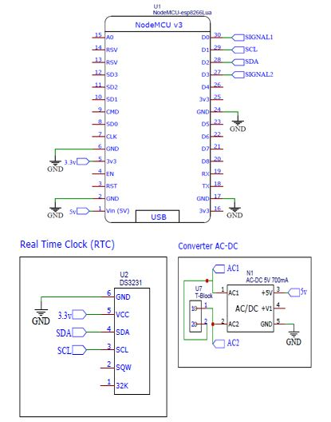
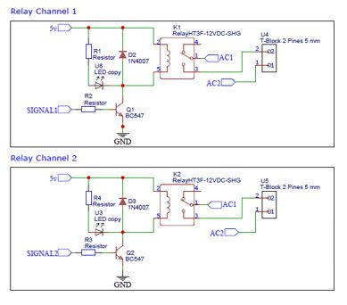
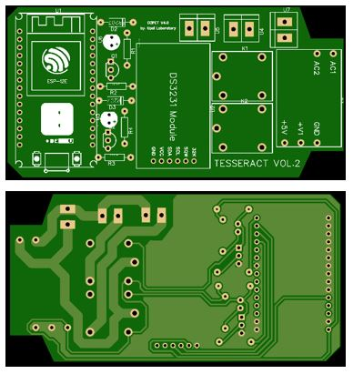

# Controller_Of_Electric_Terminal (COPET)

The program written with Nodemcu ESP8266 V3 in .cpp format with C native language in Visual Studio Code with arduino platform. The electric terminal was controlled by smartphone via localhost wifi.

Activation (ON/OFF) of each electric terminal controlled via smartphone. Switch of the terminal using Relay 2 channel which controlling every electric circuit.

Electronic schematic and PCB layout can be found in following images.

